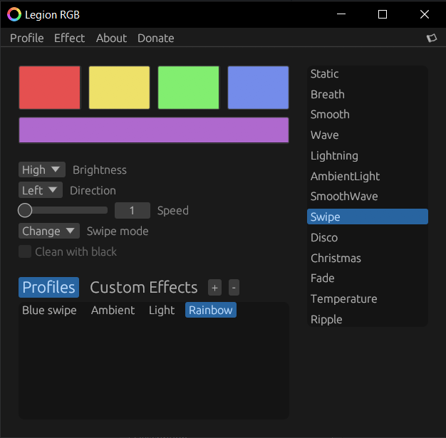

# Legion RGB Control <!-- omit in toc -->

[](https://github.com/4JX/L5P-Keyboard-RGB/releases)

[](https://discord.gg/rQEQzsyPe8)

<div align="center">


<a href="https://www.buymeacoffee.com/4JXdev"></a>
[](https://liberapay.com/4JX/donate)

</div>

## Index <!-- omit in toc -->

- [Download](#download)
- [Available effects](#available-effects)
  - [Creating your own effects](#creating-your-own-effects)
    - [At a glance](#at-a-glance)
    - [File sections](#file-sections)
- [Usage](#usage)
  - [Format](#format)
  - [With GUI](#with-gui)
  - [Via the command line](#via-the-command-line)
- [Compatibility](#compatibility)
  - ["How about X model"](#how-about-x-model)
- [Building from source](#building-from-source)
  - [Prerequisites](#prerequisites)
    - [Linux (Ubuntu)](#linux-ubuntu)
  - [Using `cargo-make`](#using-cargo-make)
  - [Building manually](#building-manually)
- [Crashes, freezes, etc](#crashes-freezes-etc)

## Download

**⚠️ Use at your own risk, the developer is not responsible for any damages that may arise as a result of using this program.**

Builds will be periodically uploaded to the [releases tab](https://github.com/4JX/L5P-Keyboard-RGB/releases).

You may also download pre-compiled versions from [here](https://github.com/4JX/L5P-Keyboard-RGB/actions/workflows/release-rust.yml) (requires github account) by clicking the latest entry with a ✅ and going under the "artifacts" section.

## Available effects

**All stock effects:** Static, Breath, Smooth, LeftWave, RightWave.

**Custom effects:**

- **Lightning:** Adds a little _spark_.
- **AmbientLight:** Reacts to content on your screen.
- **Smooth(Left/Right)Wave:** An implementation of the classic wave effect.
- **(Left/Right)Swipe:** Transitions the selected colors from side to side, useful for custom waves.
- **Disco:** A portable dance floor!
- **Christmas:** Even keyboards can get festive.
- **Fade:** Turns off the keyboard lights after a period of inactivity.
- **Temperature:** Displays a gradient based on the current CPU temperature. (Linux only)

### Creating your own effects

The best way to add a new effect is to directly edit the source code, as it allows the most flexibility. You can however also use the built-in feature to make basic effects.

#### At a glance

- You can make custom effects using a `json` file with the following format:

```json
{
  "effect_steps": [
    {"rgb_array": [0, 0, 0, 0, 100, 0, 0, 0, 0, 0, 0, 0], "step_type": "Set", "brightness": 1, "steps": 100, "delay_between_steps": 100, "sleep": 100},
    {"rgb_array": [0, 100, 0, 0, 0, 200, 0, 0, 200, 200, 0, 0], "step_type": "Transition", "brightness": 1, "steps": 100, "delay_between_steps": 100, "sleep": 100}
  ],
  "should_loop": true
}
```

#### File sections

- **effect_steps:** Contains the different _"steps"_ the effect will go through.
  - **rgb_array:** An array describing the colours to use in the `[r,g,b,r,g,b...]` format.
  - **step_type:** The type of step to use. You may instantly swap the colours with `Set` or smoothly transition to them with `Transition`.
  - **brightness:** The brightness of the step, can be `1` (low) or `2` (high).
  - **steps:** To smoothly transition between colours, the keyboard LEDs are set at small intervals until they reach the desired color. This controls the number of them.
  - **delay_between_steps:** How much time to wait between each interval (In ms).
  - **sleep:** The time to wait before going to the next `effect_step` (In ms).
- **should_loop:** Whether the effect should start again once it reaches the last step.

## Usage

**Note**: By default, on Linux you will have to run the program with root privileges, however, you can remedy this by adding the following `udev` rule (in a path similar to `/etc/udev/rules.d/99-kblight.rules`):

### Format

```sh
SUBSYSTEM=="usb", ATTR{idVendor}=="048d", ATTR{idProduct}=="####", MODE="0666"
```

Where `idProduct` can be found in these tables:

| Year | Pro    | Regular + Slim | LOQ    |
| ---- | ------ | -------------- | ------ |
| 2024 | `c995` | `c994`         | `c993` |
| 2023 | `c985` | `c984`         | `c983` |

| Year | Pro + Regular + Slim | Ideapad |
| ---- | -------------------- | ------- |
| 2022 | `c975`               | `c973`  |
| 2021 | `c965`               | `c963`  |
| 2020 | `c955`               |         |

And then reloading the rules:

```sh
sudo udevadm control --reload-rules && sudo udevadm trigger
```

### With GUI

Execute the file by double-clicking on it. You may pass extra startup options via the CLI by also specifying the `--gui` flag.

Configuration for this mode is saved by default on the folder the program was executed in a file called `settings.json`, you can override this location by setting the `LEGION_KEYBOARD_CONFIG` environment variable.

### Via the command line

Usage:

```sh
legion-kb-rgb [OPTIONS] [SUBCOMMAND]
```

Examples:

- Getting the help prompt

```sh
legion-kb-rgb --help
```

- Setting the keyboard to red

```sh
legion-kb-rgb set -e Static -c 255,0,0,255,0,0,255,0,0,255,0,0
```

- Using the SmoothWave effect going to the left with speed `4` and brightness at high

```sh
legion-kb-rgb set -e SmoothWave -s 4 -b 2 -d Left
```

## Compatibility

This program has been tested to work on:

- Legion 5 (Pro) 2020, 2021, 2022, 2023, 2024
- Ideapad Gaming 3 2021, 2022, 2023, 2024

### "How about X model"

- **Legion 7(i):** Won't work, the backlight on these is per-key and uses a different way of communicating.
- **Any variant with a white backlight:** Haven't figured out how to talk to this one yet, but given the limited number of states (off, low, high) there's not many effects I'd be able to add anyways.

## Building from source

### Prerequisites

- [Rust](https://www.rust-lang.org/tools/install)
- [Git](https://git-scm.com/downloads)

#### Linux (Ubuntu)

```sh
sudo apt-get install -y libclang-dev libxcb-shm0-dev libusb-1.0-0-dev libx11-dev nasm libdbus-1-dev libudev-dev libxcb-randr0-dev libgstreamer1.0-dev libgstreamer-plugins-base1.0-dev libxi-dev libxtst-dev libpango1.0-dev libgtk-3-dev libxdo-dev libappindicator3-dev
```

<!-- #### Windows -->

<!-- Follow [this guide](https://gtk-rs.org/gtk4-rs/stable/latest/book/installation_windows.html#pkg-config) but build GTK3 instead of GTK4. -->

### Using `cargo-make`

Works on both Windows and Linux.

- Install `cargo-make`

```sh
cargo install cargo-make
```

- Clone the repository

```sh
git clone https://github.com/4JX/L5P-Keyboard-RGB.git
```

- Build the project

```sh
cd L5P-Keyboard-RGB/
cargo make build-release
```

### Building manually

- Download and bootstrap [VCPKG](https://github.com/Microsoft/vcpkg#getting-started)
- You'll need to set an environment variable called `VCPKG_ROOT` pointing to the directory where you downloaded and bootstrapped VCPKG.

- Download the VCPKG dependencies

Windows:

```cmd
vcpkg update && vcpkg install libvpx:x64-windows-static libyuv:x64-windows-static
```

Linux:

```sh
vcpkg update && vcpkg install libvpx libyuv
```

- Clone the repository

```sh
git clone https://github.com/4JX/L5P-Keyboard-RGB.git
```

- Build the project

```sh
cd L5P-Keyboard-RGB/
cargo build --release
```

## Crashes, freezes, etc

I cannot guarantee this solution will work for anyone but myself. That being said feel free to open an issue if you encounter any of these problems on the [issues tab](https://github.com/4JX/L5P-Keyboard-RGB/issues).

---

Thanks to legendk95#0574 (272711294338072577) over at discord for initially reverse engineering the way to talk to the keyboard.
